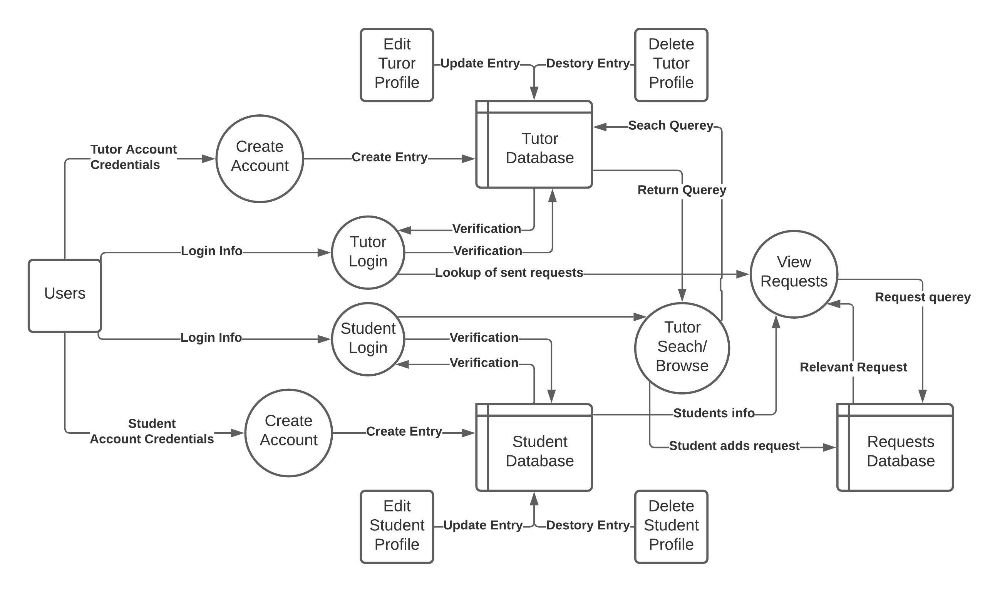
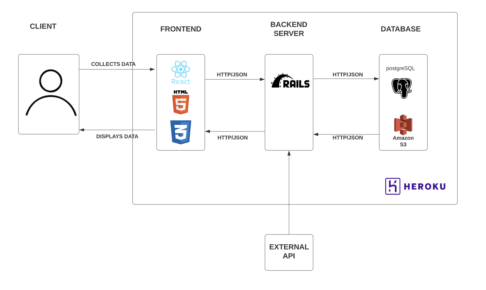
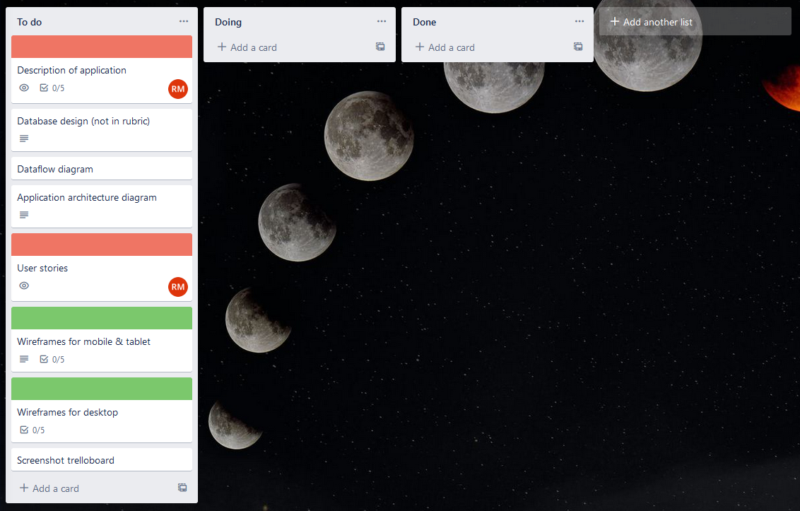
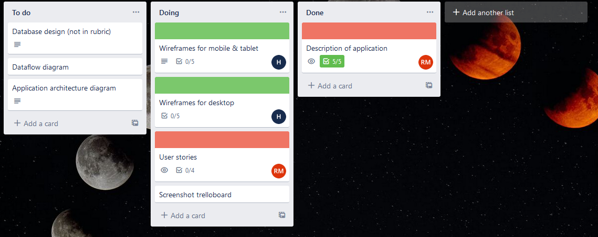
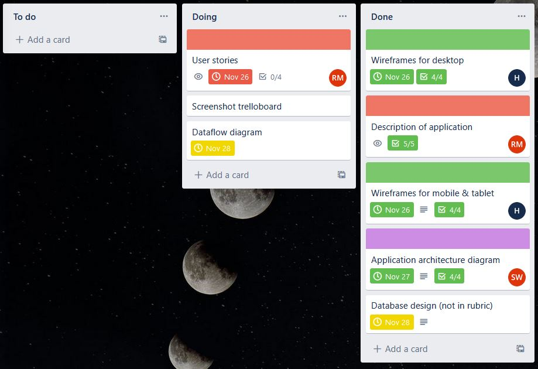
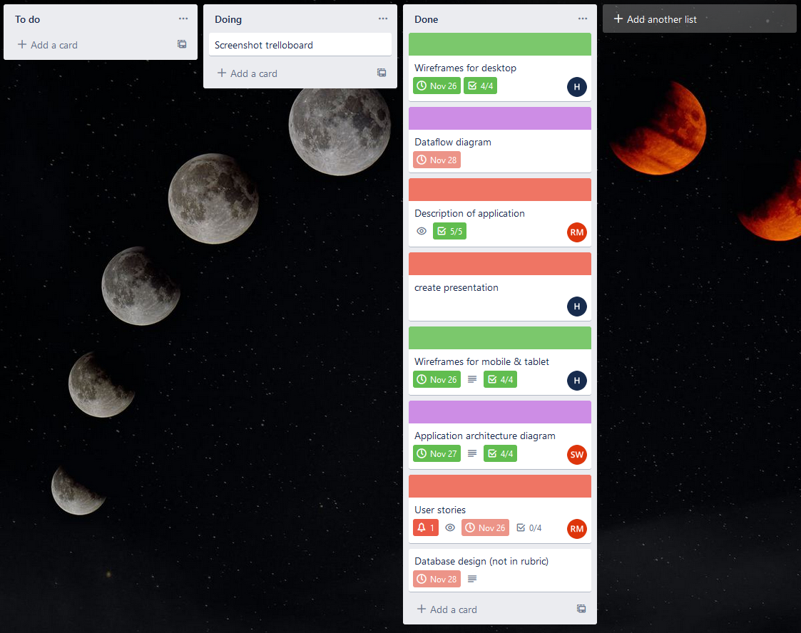
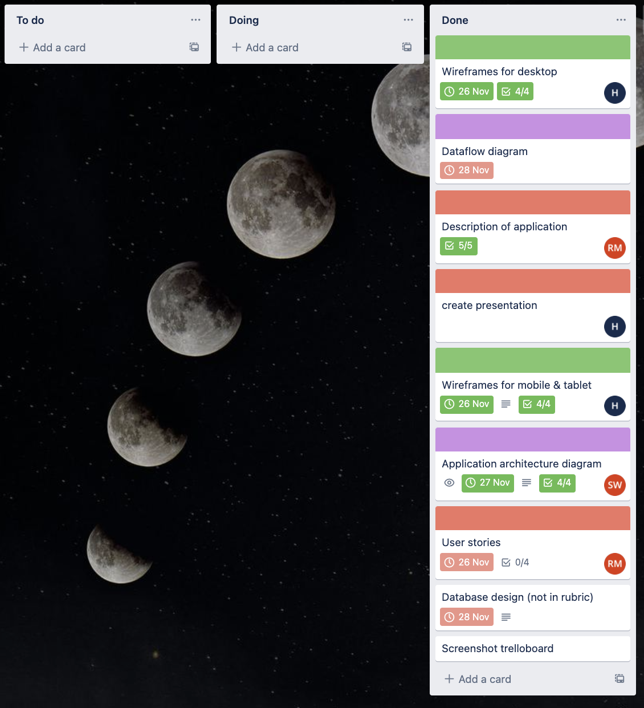
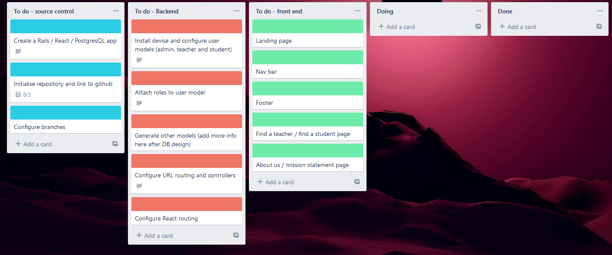

# Tutal

**T3A2-A** 

Hannah M

Safia W

Russell M

A link to our Github repository can be found [here](https://github.com/russ-13/react-tutal)

## Description (R1)

**Overview**

Tutal will connect those looking to find a tutor or mentor-ship with those who are looking to provide that service on a centralized platform.

 Students can filter through available tutors based on the type of tuition required, level of experience, price range, and location; providing a means to connect with them and leaving a review if they wish. 

Industry professionals or experienced students can make a profile that shows their availability, areas of expertise, and availability, and features a dashboard to manage incoming requests and students they are currently engaging. 

Tutal may host a suite of online 'Virtual Tutor' tools to aid students, among these features may be a spelling and grammar assistant, mathematics skill practice, and links to online reference material. The completeness of the Virtual Tutor suite will vary throughout the development timeline and more 'nice to have' tools may be added by deployment time.  

**Problem**

Finding tutors or study help can be difficult in a real-world setting, especially as more education moves towards remote delivery. 

Students or self self-educators need a centralized platform to get in touch or STEM professionals or experienced students for appropriate tutoring or mentor-ship, either online or in their local area, at a price point they are happy with. 

Those looking to offer private tuition need a way to market their skills to offer short or long-term tutoring sessions that fits within their schedules.

Existing classifieds and job boards lack both a centralized platform for these meetings and additional tools for students; making finding tuition relating to specific needs and extra help offered by online tools difficult to find. 

**Purpose**

Tutal will deliver to our client a marketplace application for people to off their tuition or mentor-ship to those wanting to learn in exchange for income. 

The app will serve as a platform for students to find appropriate tutors based on their preferences as well as possibly providing online tools useful to their study path. 

### Functionality/Features

**Authentication**

Authentication will allow users to log in, or sign up as either a tutor or student/parent. Upon clicking login/signup a modal will be presented to the user with account creation/credential fields, utilizing [omniauth](https://github.com/omniauth/omniauth) to facilitate users existing Facebook or Google accounts. Forgotten password tools and a privacy policy will be present for the signup/login modals respectively. 

**Authorization**

Authorization will be used to allow site administrators to remove data and allow teachers/students to edit their profiles and requests page functionality will change according to the authorization level of the logged-in user. 

**Profiles**

Teachers will have a publicly available profile, containing their availability, skill sets, photo, general 'about me' information, tutoring style (online, location-based), and pricing information. Students will have a profile not available for users to browse, but to keep information available to their tutor. 

**Search/Browse**

Logged in students will be able to search or browse for prospective tutors. Browsing can be done by subject or viewing tutors that are near you, and a search feature will provide filters for subject, level of experience, location, price range, and whether online tuition is available from the provider. 

**Requests**

Users can send a request to a potential tutor through the application. Upon receiving a request, it can either be accepted or denied or a contact button will be displayed should the teacher have any queries about the request. 

**Ratings**

Tutors will have a rating attached that can only be added to by a student with a previous successful request, allowing other students to get some idea of the value a particular tutor may offer. 

**Virtual Tutor**

**Planned to be implemented as 'nice to have' features once the MVP application is completed. The Virtual Tutor feature is not part of our assignment, its place on the roadmap is to be developed after the core assessment is completed.** A suite of 'Virtual Tutor' tools will be included. Among these at this stage are utilizing [Youtube API](https://discord.com/channels/@me/912507496722210816/913273722943733760) to display educational content, a built-on math problem practice area, and link hosting to other helpful online tools for students. We have submitted an application to use the [Grammarly API](https://developer.grammarly.com/) for educational purposes, hoping to include a grammar and spelling check feature. 

### Target Audience

The target audience is reflected in two groups. First will be current students of STEM (Science, Technology, Engineering, Math) fields looking for tutoring on specific subjects, and non-students or those self-educating that may not have access to study groups or tutoring programs at a formal university. 

Secondly, the target audience will include experienced students or industry professionals looking to market their knowledge and skills in the form of tutoring for income. Experienced current students or post-grads that are looking for part-time income to supplement existing positions  

### Tech Stack

ReactJS/HTML/CSS/Styled Components || Front-end

Ruby on Rails API || Back-end

PostgreSQL || Database 

Heroku - Deployment -

## Data-flow Diagram (R2)

## Application Architecture Diagram (R3)

## User Stories (R4)

**ALL USERS**

### Ella

As a user, I want to easily be able to create an account where I can store information personal to me. My Tutal account should allow me to view, edit or delete information as I need. This will ensure my data is safe and that the information I view on Tutal is relevant to me. 

**STUDENTS**

### Stacey

As a student, I want to be able to search for tutors in my local area. This will make my tutor search more relevant to my current location, and therefore improve my chance of finding a tutor which suits me best.

### James

As a student, I want to easily be able to find tutors by subject and level of experience. This is so I can quickly filter results and find a tutor which suits me best. 

### Damien

As a student, I want to easily be able to request a tutor. This is so that I can quickly let a tutor know that I am interested in their services.

### Jasmin

As a student, I want to be able to rate my tutors and leave a review after my session. This will improve my experience as I can then view the ratings of other tutors and therefore make more informed decisions when choosing a tutor.

**TUTORS**

### Hugh

As a tutor, I want to be able to list personal information such as my skills, qualifications, location and years of experience. This will allow me to show students valuable information and help them see why I would make a good tutor

### Vincent

As a tutor, I want to easily be able to view requests sent by students. Being notified of a new request will be important so that I can quickly respond and gain a client faster. 

### Gibby

As a tutor, I want to easily be able to accept/decline requests. This will allow me to quickly respond to students to let them know that I am available for tutoring.

### Tanya

As a tutor, I want to be able to easily view the contact information of a student from who I have accepted a request. This is so I can get in touch with them to hear more about their studies and begin organizing a session.

**ADMIN**

As an admin, I want to be able to manage tutor and student profiles to ensure that information included is appropriate for the demographic. This will improve the experience for all users as it prevents offensive content posted. 

## Wireframes  (R5)

A link to our full figma board can be found here [https://www.figma.com/file/lrFVx6Hy2dmb3Bx6fODafE/Tutal?node-id=0%3A1](https://www.figma.com/file/lrFVx6Hy2dmb3Bx6fODafE/Tutal?node-id=0%3A1)

.png)

.png)

.png)

.png)

.png)

.png)

.png)

.png)

.png)

## Trello (R6)

Tasks for our project are outlined and managed with Trello. There are two boards within our workspace, Documentation, and Development. The development board represents our four days of in-class work throughout the development process. 

**Documentation Board**

**Development Board (planned)**

##